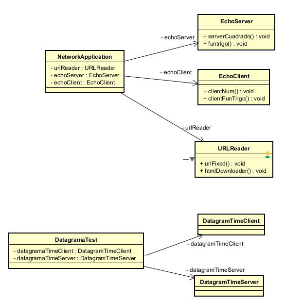

# Networking Project

Proyecto que implementa diferentes aspectos de networking usando Java, incluyendo sockets TCP/UDP, RMI y manejo de URLs.

## Descripción

Este proyecto demuestra diferentes conceptos de redes y comunicación en Java:

- Lectura y descarga de contenido desde URLs
- Servidor TCP para cálculo de cuadrados
- Servidor TCP para funciones trigonométricas 
- Servidor/Cliente UDP para servicio de hora
- Chat P2P usando RMI (Remote Method Invocation)

## Requisitos

- Java 17
- Maven
- Spring Boot 3.5.0

## Instalación

```bash
git clone https://github.com/DavidBarbosag/Networking.git
cd Networking
mvn clean install
```

## Uso

Ejecutar la aplicación:
```bash
mvn clen package
cd Networking
java -Djava.rmi.server.hostname=localhost -jar target/networking-0.0.1-SNAPSHOT.jar
```

Ejecutar la prueba de servidor de hora con UDP (Pruebas al Servidor UDP):
```bash
mvn clean package
cd Networking
java -cp . com.eci.ARSW.Networking.DatagramaTest
```

**Para la ejecucion correcta se deben tener dos consolas ejecutandose al mismo tiempo, debido al funcionamineto del servicio de chat**

**Terminal 1** 

Ingrese el puerto local para publicar el servicio RMI: → escribe: 1099

Ingrese la IP del usuario remoto: → escribe la IP del usuario B (por ahora puedes poner algo falso como 127.0.0.1 para que quede esperando)

Ingrese el puerto remoto: → 1100

Este usuario se quedará esperando hasta que el otro esté disponible.

**Terminal 2 (Usuario B — cliente que se conecta)**


Ingrese el puerto local para publicar el servicio RMI: → 1100

Ingrese la IP del usuario remoto: → 127.0.0.1

Ingrese el puerto remoto: → 1099

Ahora ambos usuarios estarán conectados

## Funcionalidades


1. URL Reader

* Lee contenido de URLs
* Descarga archivos HTML
* Servidor de Cuadrados (Puerto 5000)


2. Recibe un número

* Devuelve su cuadrado
* Servidor Trigonométrico (Puerto 6000)


> Soporta operaciones:
Seno (fun:sin)
Coseno (fun:cos)
Tangente (fun:tan)
Servidor/Cliente UDP (Puerto 4445)


3. Servicio de hora

* Actualizaciones periódicas

4. Chat RMI
* Comunicación P2P
* Intercambio de mensajes en tiempo real

## Diseño tecnico

* Sockets TCP/UDP: implementados con Socket, ServerSocket, DatagramSocket.

* RMI: usa LocateRegistry, Remote y UnicastRemoteObject.

* Hilos: cada servidor (cuadrado, trigonometría, UDP) corre en un Thread.

* Spring Boot: gestiona el arranque y estructura del proyecto.

* Escáneres (Scanner): usados para entradas dinámicas del usuario.

## Diagramas de Clases

